{width="6.5in"
height="1.9895833333333333in"}

**Lab Center -- Hands-on Lab**

**Session 5257**

**Agile Integration with App Connect Enterprise**

Prasad Imandi, IBM, imandi\@us.ibm.com

Michael Alley, IBM, malley\@us.ibm.com

**Table of Contents** {#table-of-contents .TOCHeading}
=====================

[**Disclaimer** 3](#disclaimer)

[**Introduction and Getting Started**
5](#introduction-and-getting-started)

[Lab Objectives 5](#lab-objectives)

[Environment used for this lab 6](#environment-used-for-this-lab)

[Getting started with Part 1: 7](#getting-started-with-part-1)

[Build a sample integration application using ACE toolkit
7](#build-a-sample-integration-application-using-ace-toolkit)

[Running a ACE docker image 14](#running-a-ace-docker-image)

[Deploying and testing the Integration with ACE docker image
15](#deploying-and-testing-the-integration-with-ace-docker-image)

[Getting Start with Part 2: 18](#getting-start-with-part-2)

[Build a standard ACE docker image
18](#build-a-standard-ace-docker-image)

[Package the integration application into the standard ACE docker image
20](#package-the-integration-application-into-the-standard-ace-docker-image)

[Load the custom docker image into IBM Cloud Private docker image
repository
23](#load-the-custom-docker-image-into-ibm-cloud-private-docker-image-repository)

[Create and load helm chart into IBM Cloud Private
26](#create-and-load-helm-chart-into-ibm-cloud-private)

[Deploy the helm chart and test the integration application
30](#deploy-the-helm-chart-and-test-the-integration-application)

[**We Value Your Feedback!** 36](#we-value-your-feedback)

**Disclaimer**
==============

IBM's statements regarding its plans, directions, and intent are subject
to change or withdrawal without notice at IBM's sole discretion.
Information regarding potential future products is intended to outline
our general product direction and it should not be relied on in making a
purchasing decision.

The information mentioned regarding potential future products is not a
commitment, promise, or legal obligation to deliver any material, code
or functionality. Information about potential future products may not be
incorporated into any contract.

The development, release, and timing of any future features or
functionality described for our products remains at our sole discretion
I/O configuration, the storage configuration, and the workload
processed. Therefore, no assurance can be given that an individual user
will achieve results like those stated here.

Information in these presentations (including information relating to
products that have not yet been announced by IBM) has been reviewed for
accuracy as of the date of initial publication and could include
unintentional technical or typographical errors. IBM shall have no
responsibility to update this information. **This document is
distributed "as is" without any warranty, either express or implied. In
no event, shall IBM be liable for any damage arising from the use of
this information, including but not limited to, loss of data, business
interruption, loss of profit or loss of opportunity.** IBM products and
services are warranted per the terms and conditions of the agreements
under which they are provided.

IBM products are manufactured from new parts or new and used parts.\
In some cases, a product may not be new and may have been previously
installed. Regardless, our warranty terms apply."

**Any statements regarding IBM\'s future direction, intent or product
plans are subject to change or withdrawal without notice.**

Performance data contained herein was generally obtained in controlled,
isolated environments.  Customer examples are presented as illustrations
of how those\
customers have used IBM products and the results they may have
achieved. Actual performance, cost, savings or other results in other
operating environments may vary. 

References in this document to IBM products, programs, or services does
not imply that IBM intends to make such products, programs or services
available in all countries in which IBM operates or does business. 

Workshops, sessions and associated materials may have been prepared by
independent session speakers, and do not necessarily reflect the views
of IBM. All materials and discussions are provided for informational
purposes only, and are neither intended to, nor shall constitute legal
or other guidance or advice to any individual participant or their
specific situation.

It is the customer's responsibility to insure its own compliance
with legal requirements and to obtain advice of competent legal counsel
as to the identification and interpretation of any relevant laws and
regulatory requirements that may affect the customer's business and any
actions the customer may need to take to comply with such laws. IBM does
not provide legal advice or represent or warrant that its services or
products will ensure that the customer follows any law.

Information concerning non-IBM products was obtained from the suppliers
of those products, their published announcements or other publicly
available sources. IBM has not tested those products about this
publication and cannot confirm the accuracy of performance,
compatibility or any other claims related to non-IBM products. Questions
on the capabilities of non-IBM products should be addressed to the
suppliers of those products. IBM does not warrant the quality of any
third-party products, or the ability of any such third-party products to
interoperate with IBM's products. **IBM expressly disclaims all
warranties, expressed or implied, including but not limited to, the
implied warranties of merchantability and fitness for a purpose.**

The provision of the information contained herein is not intended to,
and does not, grant any right or license under any IBM patents,
copyrights, trademarks or other intellectual property right.

IBM, the IBM logo, ibm.com and \[names of other referenced IBM products
and services used in the presentation\] are trademarks of International
Business Machines Corporation, registered in many jurisdictions
worldwide. Other product and service names might be trademarks of IBM or
other companies. A current list of IBM trademarks is available on
the Web at \"Copyright and trademark information\" at[:
www.ibm.com/legal/copytrade.shtml](http://www.ibm.com/legal/copytrade.shtml).

© 2019 International Business Machines Corporation. No part of this
document may be reproduced or transmitted in any form without
written permission from IBM.

**U.S. Government Users Restricted Rights --- use, duplication or
disclosure restricted by GSA ADP Schedule Contract with IBM.**

**\
**

**Introduction and Getting Started**
====================================

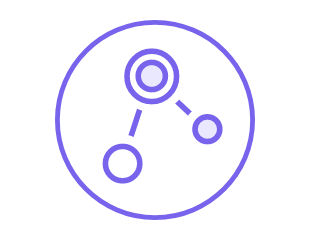{width="2.1527777777777777in"
height="1.7361111111111112in"}

IBM App Connect Enterprise V11 delivers a platform that supports a
breadth of integration needs across a modern digital enterprise. It is
ideal for businesses that need to take advantage of API-driven
architectures, connect cloud-based applications, or quickly extend the
value and investment in their existing data and systems.

Available as managed or unmanaged cloud or as an on-premises offering,
App Connect Enterprise delivers a range of capabilities to optimize the
creation and deployment of integrations.

IBM App Connect Enterprise enables you to adopt agile integration
architecture \< expand on this\>

-   **Aigle Integration Architecture**

-   

Lab Objectives
--------------

The objectives of this lab is to demonstrate the concepts of Agile
Integration Architecture with ACE with a simple light weight Integration
application deployed within a docker container to Kubernetes in IBM
Cloud Private (ICP). This lab is divided into two parts.

In Part 1, you will assume the role of a developer and build a sample
integration application and test the application locally using a ACE
docker image.

In Part 2, you will assume the role of operations and build a standard
base ACE docker image for your higher level environments e.g. QA,
Production. You will package the integration application with the ACE
standard image you have built and deploy it to higher level environments
using a helm chart.

Environment used for this lab
-----------------------------

1.  Ubuntu V1604

2.  ACE v11.0.0.2 Toolkit

3.  Docker and Helm

4.  ACE Docker images and Helm charts are downloaded from public Github
    repositories

5.  IBM Cloud Private V3.1 (ICP)

Getting started with Part 1:
============================

In this part of the lab, you will assume the role of a DEVELOPER and
perform the following tasks.

-   Build a sample integration application using ACE toolkit. This will
    be a REST API that returns a customer record for an ID.

-   Pull ACE docker image from Docker Hub following instructions on
    Docker Hub <https://hub.docker.com/r/ibmcom/ace/>

-   Run a Integration Server within a docker container for local
    testing.

-   Perform local testing of your application as a developer by
    deploying the BAR file to a local Docker ACE Container.

Build a sample integration application using ACE toolkit
--------------------------------------------------------

1.  Open a terminal and start ACE toolkit with command **ace tools**

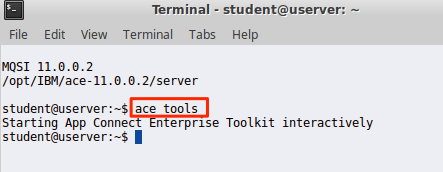{width="4.088735783027122in"
height="1.221311242344707in"}

2.  Enter a workspace directory. You can keep the default directory
    without making any changes

> {width="4.025784120734908in"
> height="2.139343832020997in"}

3.  The toolkit will appear with the **Welcome** screen shown, dismiss
    this by clicking on the **x**:

> 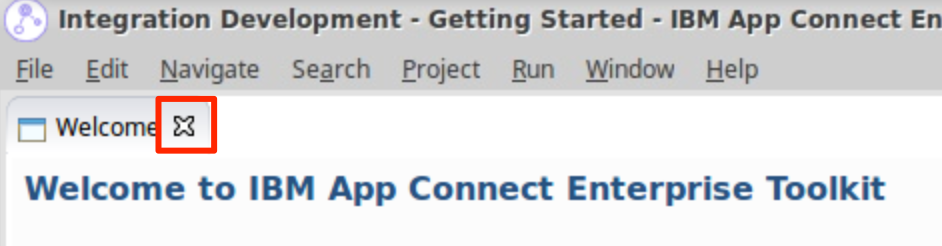{width="3.0901640419947505in"
> height="0.8068766404199476in"}

4.  Create a REST API by selecting **New REST API...**

> 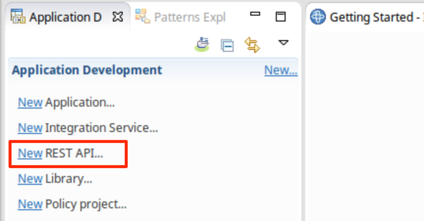{width="3.2868055555555555in"
> height="1.385246062992126in"}

5.  Name the REST API **Customer,** and the base path will automatically
    be generated. Click **Finish** to create the API.

> 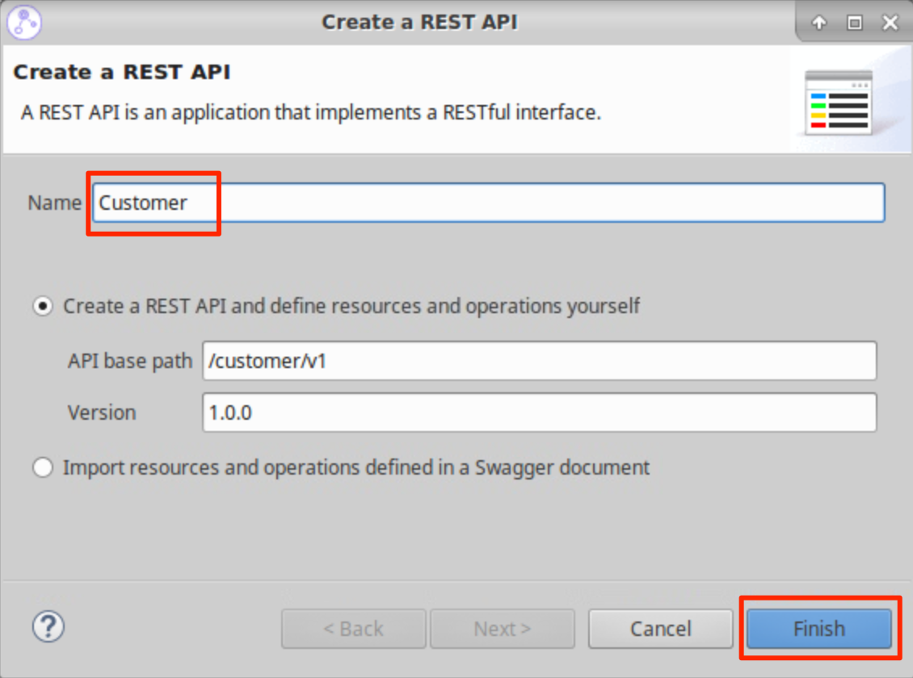{width="4.270138888888889in"
> height="2.1803280839895014in"}

6.  Click Finish to create the API.

7.  The API consists of two parts: the model definitions that describe
    the data structure, and the resources that define the interface to
    access the data. The first step in creating a REST API is to define
    the Model. Within the Model Definition section, overwrite the
    **\<Enter a unique name to create a new model\>** with **Customer**
    and press **enter:**

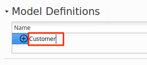{width="2.671527777777778in"
height="0.8278685476815398in"}

8.  Select the **Customer** entry, and click the **Add Button** to add a
    child element:

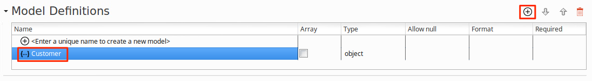{width="5.647540463692039in"
height="1.0652777777777778in"}

9.  Replace the name **element1** with **ID**:

> 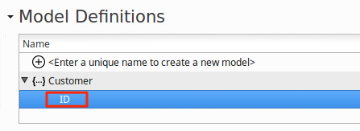{width="3.742014435695538in"
> height="1.172130358705162in"}

10. Repeat the process to create the following additional elements:

-   firstName

-   lastName

-   phone

> 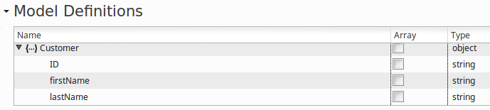{width="5.560812554680665in"
> height="0.9180325896762904in"}

11. Now that the model definition has been created, the Resources can be
    added, click on the **+** button associated with the **Resources**
    section:

> 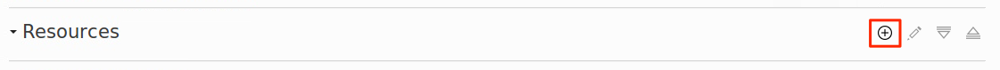{width="5.560416666666667in"
> height="0.4583333333333333in"}

12. The Create Resource pop-up with appear, enter **{id}** for Resource
    path, and check the **GET** operation. Click **OK** to complete the
    Create Resource.

> 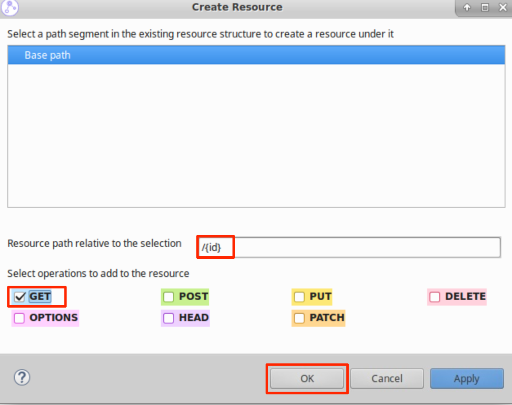{width="3.3194444444444446in"
> height="2.286885389326334in"}

13. When resource path was created as **/{id},** **{}** tell the toolkit
    that content is a variable, and therefore the parameter **id** has
    been created. On the far right hand side there is a subflow icon
    {width="0.22688976377952755in"
    height="0.19327646544181978in"}. This provides access to the
    implementation of the operation. The response from the operation has
    automatically been generated and the return type set as
    **Customer.**

> 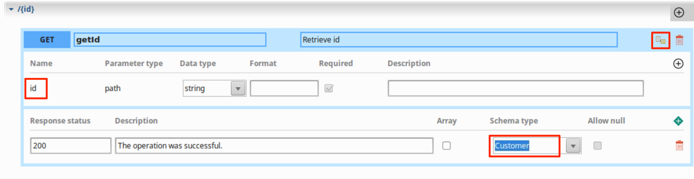{width="5.9098359580052495in"
> height="1.6777777777777778in"}

14. On the far right side, click on the subflow icon
    {width="0.2123173665791776in"
    height="0.19108595800524936in"} to open up the implementation for
    the operation.

15. A subflow will open up with an Input and Output node. Add a Mapping
    node to the canvas by:

> {width="4.25409886264217in"
> height="3.406961942257218in"}

16. The nodes need to be wired together. **Click** the Out terminal
    associated with the Input node to the input terminal of the Mapping
    node. **Click** on the Out terminal of the Mapping node to the In
    terminal of the Output node.

> 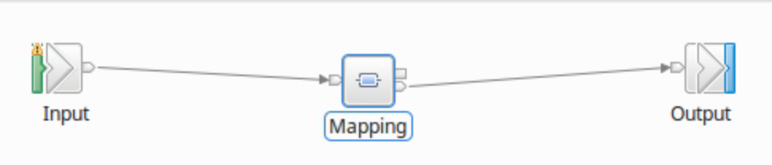{width="2.631147200349956in"
> height="0.5630544619422572in"}

17. Double click on the Mapping node to open the Map wizard. Accept the
    default and click Finish.

    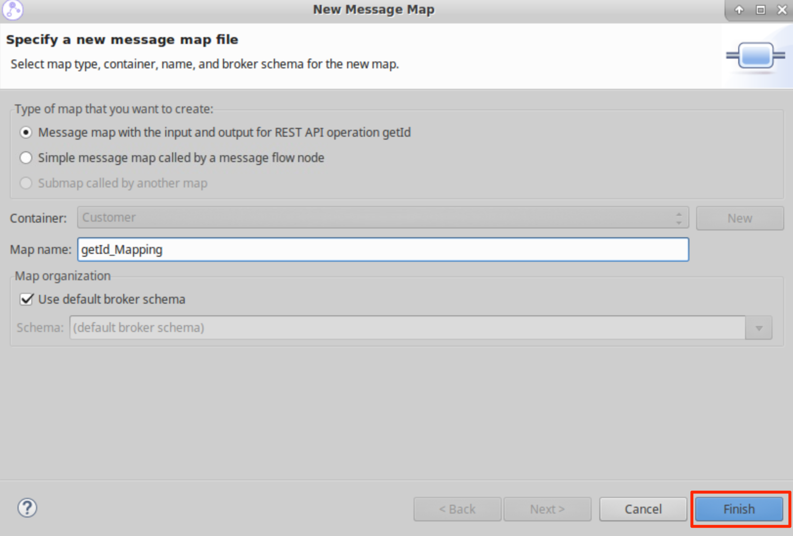{width="3.7459011373578304in"
    height="2.5356878827646545in"}

18. The default configuration will create a map between the input and
    outputs for API operation. Expand the output structure **JSON \--\>
    Data**

> 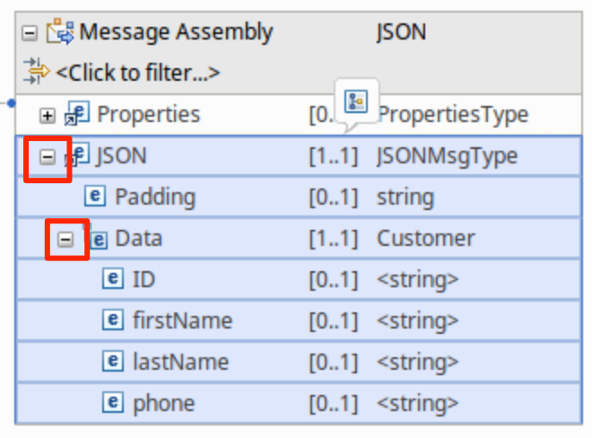{width="2.5819674103237094in"
> height="1.9090912073490813in"}

19. Hover over the **firstName** element and a small yellow circle will
    appear to the left:

> 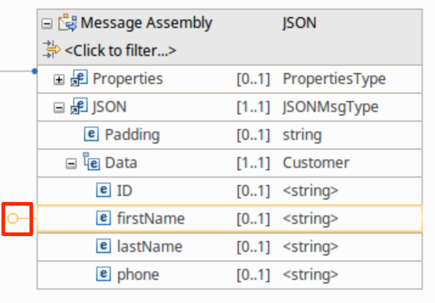{width="2.163934820647419in"
> height="1.5092989938757655in"}

20. Click on the yellow circle and click again to create a Assign
    operation.

> 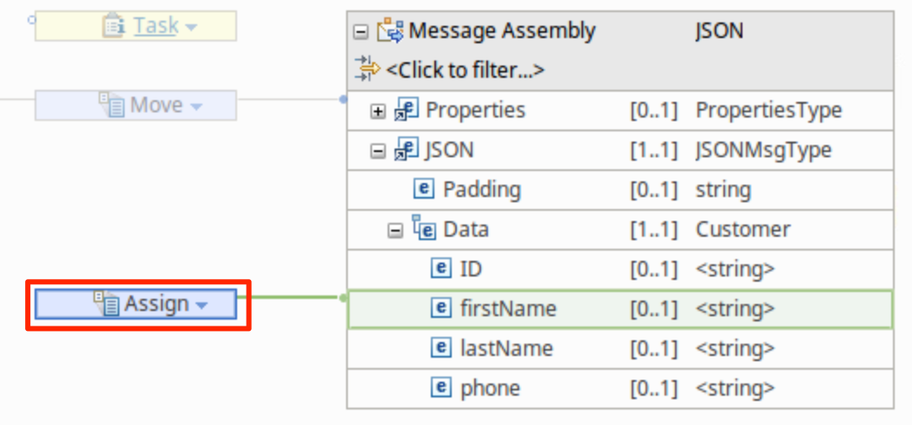{width="3.5245898950131234in"
> height="1.645184820647419in"}

21. In the properties pane below, provide a **Value**. This will assign
    a default value for the firstName element.

    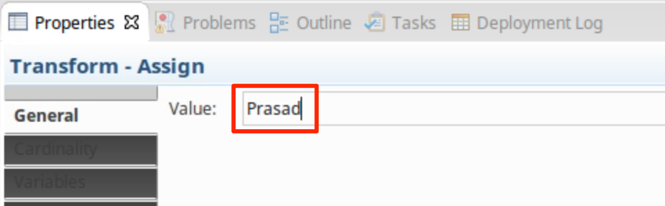{width="3.1721314523184603in"
    height="0.9848523622047244in"}

22. Repeat the steps and assign default values for **lastName** and
    **phone** elements

23. Expand the input structure **LocalEnvironment \--\> REST \--\> Input
    \--\> Parameters**

    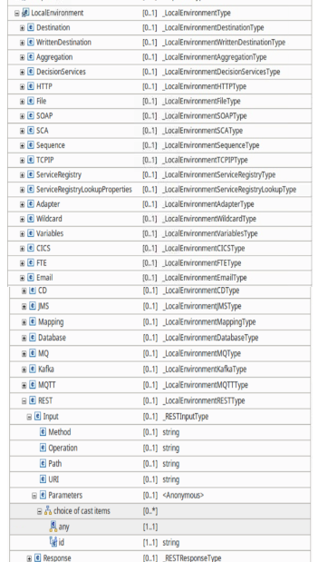{width="3.2459011373578304in"
    height="5.724253062117235in"}

24. Hover over the **id** element and a small yellow circle will appear
    to the right:

    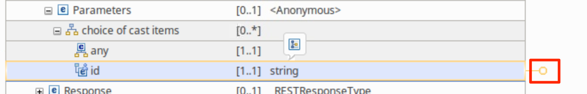{width="3.7980839895013125in"
    height="0.6147539370078741in"}

25. Click on the yellow circle and click on the **ID** element on the
    output structure. This will automatically create a **Move** option
    between the two.

> 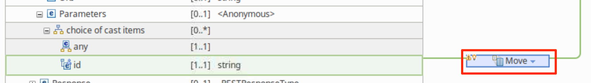{width="4.106557305336833in"
> height="0.5804461942257217in"}

26. The output structure should appear as follows after the above steps:

    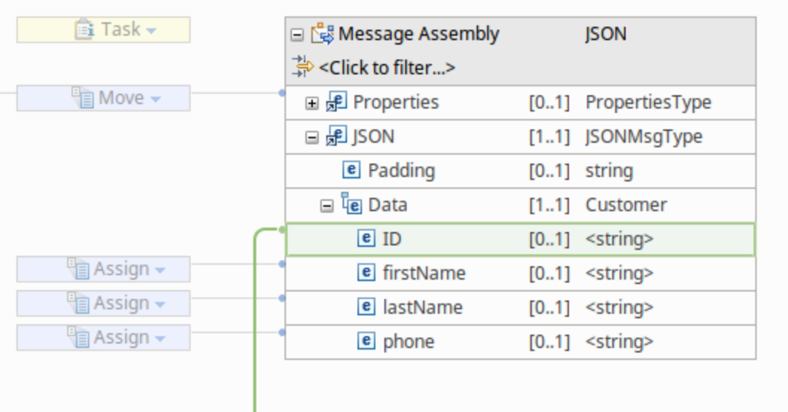{width="4.398877952755906in"
    height="1.8278685476815397in"}

27. Save and close everything.

Running a ACE docker image
--------------------------

28. Now that developing the integration flow is complete, we will test
    the flow locally using ACE for Developers docker image. ACE for
    Developers docker image is available on Docker Hub -
    <https://hub.docker.com/r/ibmcom/ace/>

29. Pull the docker image for ACE from Docker Hub repository using
    command:

docker pull ibmcom/ace

> The docker image is already loaded in the lab environment to save time
> from downloading the image.

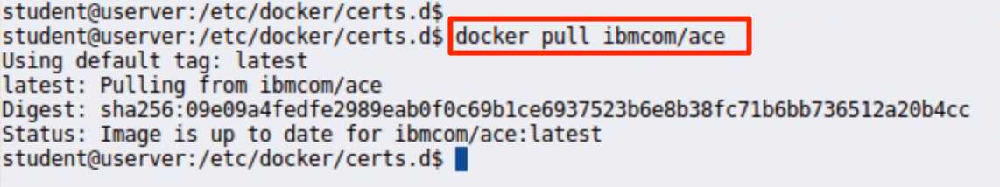{width="4.999141513560805in"
height="0.8114752843394576in"}

30. See the images available in local repository using command:

    docker images

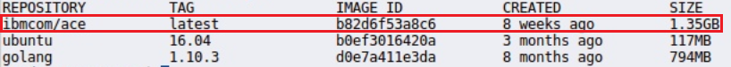{width="4.998611111111111in"
height="0.9506944444444444in"}

31. For local testing of the integration flow, run the ACE image in a
    docker container using command:

    docker run \--name myaceserver -p 7600:7600 -p 7800:7800 -p
    7843:7843 \--env LICENSE=accept \--env ACE\_SERVER\_NAME=MYACESERVER
    ibmcom/ace:latest

32. The command will start ACE in a docker container. You should see the
    following messages:

> 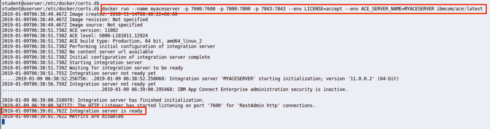{width="6.497916666666667in"
> height="2.221312335958005in"}

33. Leave the terminal window open with the integration server running
    in docker container. If you interrupt the command it will stop the
    Integration server and terminate the container

Deploying and testing the Integration with ACE docker image
-----------------------------------------------------------

34. Switch over to ACE Toolkit to connect to the integration server
    running in the container. Right-click on **Integration Servers** and
    click on **Connect to an Integration Server**

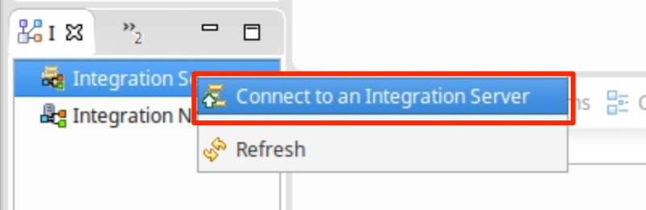{width="4.00625in"
height="0.9836067366579178in"}

35. In the Connection details pop up window, enter the following and
    click **Finish**:

    Host name: localhost

    Port: 7600

    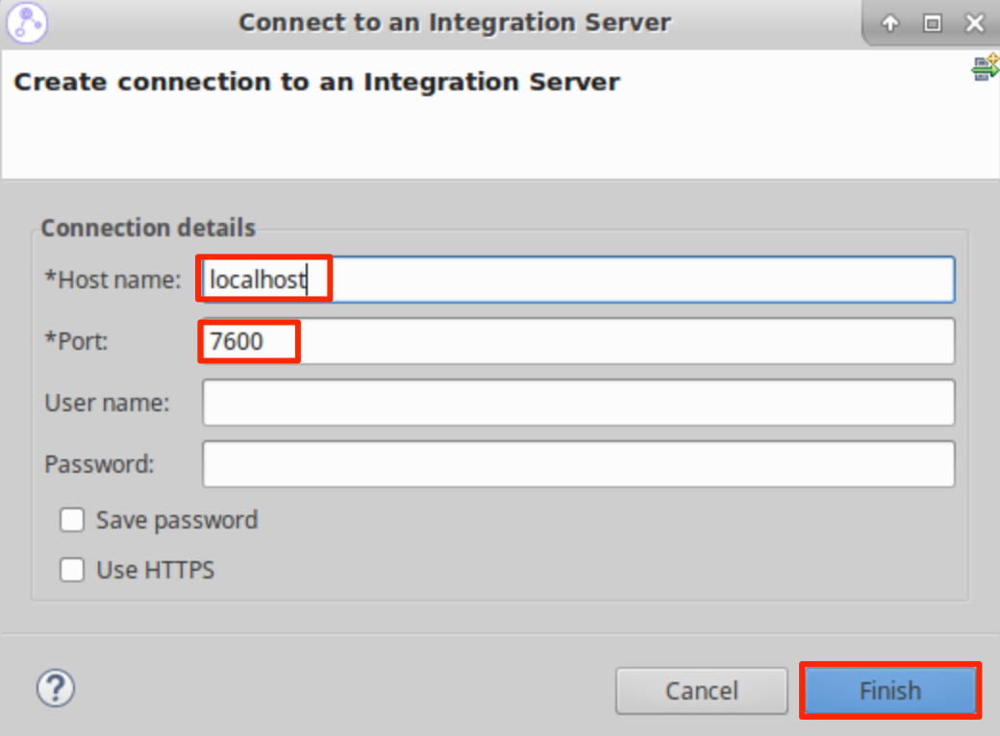{width="3.5in"
    height="2.577884951881015in"}

36. Under Integration Servers, you should see the integration server
    MYACESERVER that was started in docker container earlier.

    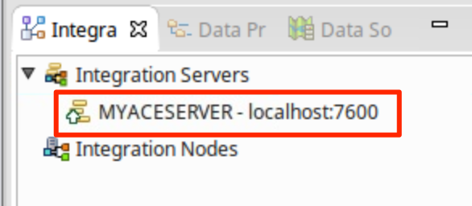{width="3.0491797900262467in"
    height="1.0in"}

37. Deploy the application **Customer** which was developed earlier by
    dragging and dropping it on the integration server.

> 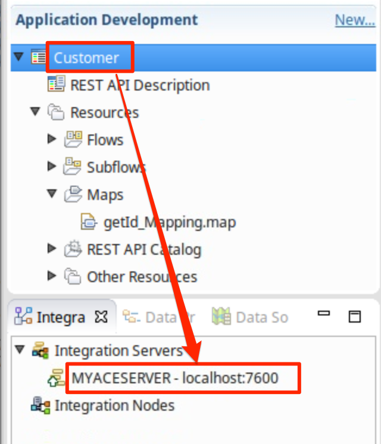{width="2.385246062992126in"
> height="2.7803029308836393in"}

38. Now that the application is deployed to integration server, we will
    test the REST API in the application. The REST API requires ID as a
    parameter. This is a sample API and you can use any number for the
    ID parameter. We will use 123 as the ID in this test. Open a firefox
    browser and enter the below url to call the API.

    http://localhost:7800/customer/v1/123

    You should see the result as shown below.

{width="3.336065179352581in"
height="1.8002635608048994in"}

This completes Part 1 of the lab.

Getting Start with Part 2: 
===========================

In this part of the lab, you will assume the role of OPERATIONS and
perform the following tasks.

-   Build a standard ACE docker image for higher level environments like
    QA and Production
    [https://github.com/ot4i/ace-docker](https://github.com/ot4i/ace-docker.).

-   Package the BAR file from Part 1 into the standard ACE docker image.
    You will use the Dockerfile and scripts provided in the public
    Github repository

-   Load the custom docker image into IBM Cloud Private docker image
    repository

-   Create a helm chart and load the helm chart into IBM Cloud Private
    catalog for deployment.

-   Deploy the helm chart to run a container environment of your
    integration application in a higher environment (QA or Production)
    running on a container orchestration platform IBM Cloud Private.

Build a standard ACE docker image
---------------------------------

1.  Open a terminal window and create directory using the command mkdir
    \<directory name\>. In this lab we are using 'ace1102image' as the
    directory name.

2.  Change into the directory and clone ACE docker public Github
    repository. This repository provides pre-built Dockerfile with a
    standard initial customization to configure and build a integration
    server docker image. Review the github repository for usage and
    guidance on customization. Clone the repository using command:

    git clone https://github.com/ot4i/ace-docker

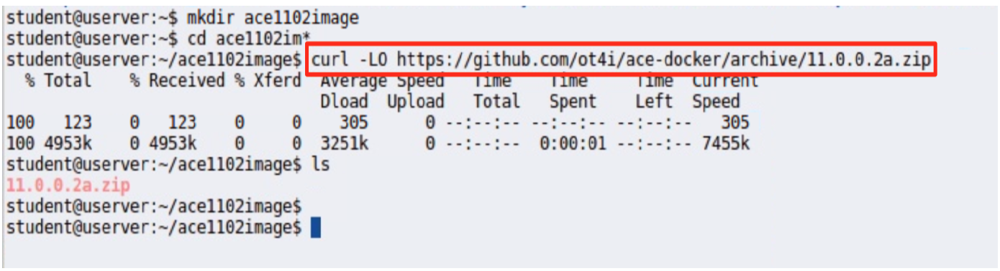{width="5.639343832020997in"
height="1.8701410761154855in"}

3.  Change directory to ace-docker and you can review the contents of
    the cloned GitHub repository.

    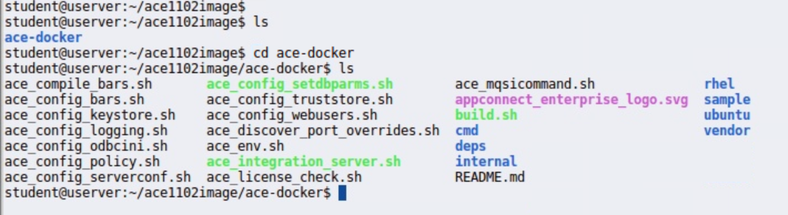{width="5.5327865266841645in"
    height="1.5120581802274715in"}

4.  The Docker files to build the image in ubuntu directory. Review the
    Dockerfiles to see the customization. For this lab, we will build
    the image using the file Dockerfile.aceonly

5.  For building a docker image, the scripts require an install image of
    ACE must be copied to deps directory. For the purpose of the lab, an
    ACE install image is made available in the directory
    /home/student/Downloads.

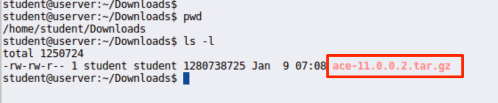{width="4.432262685914261in"
height="0.9262292213473315in"}

6.  Copy the ACE install image file ace-11.0.0.2.tar.gz to directory
    /home/student/ace1102image/ace-docker/deps

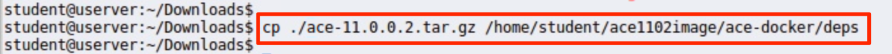{width="5.75409886264217in"
height="0.39861111111111114in"}

7.  Change directory to /home/student/ace1102image/ace-docker to run the
    command to build an ACE image.

8.  Run the command to build an image ACE image. Since the install
    package is ACE V11.0.0.2, we will name the image as
    **ace1102image**. You can build version specific images and run
    multiple versions of ACE as containers. Enter the command to use
    **Dockerfile.aceonly** to build the image:

> Docker build -t ace1102image --build-arg
> ACE\_INSTALL=ace-11.0.0.2.tar.gz \--file ubuntu/Dockerfile.aceonly .

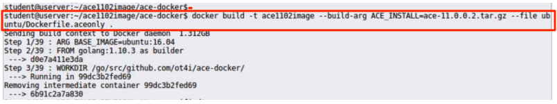{width="5.6311472003499565in"
height="1.2208333333333334in"}

9.  On completion of the image build, you should see a Successfully
    built message. Run the command 'docker images' to see the image that
    was built in previous step

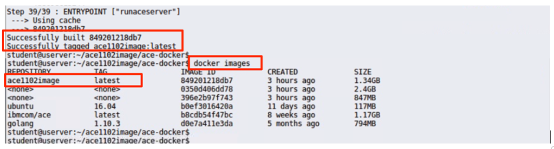{width="5.6305555555555555in"
height="1.75in"}

Package the integration application into the standard ACE docker image
----------------------------------------------------------------------

10. Next, using the **ace1102base** image built in previous steps, we
    will build a new image which includes the integration application
    that was developed in Part 1 of the lab. The GitHub repository
    directory '/home/student/ace1102image/ace-docker/sample' provides
    the **Dockerfile** that can be used for this purpose.

11. Change directory to '/home/student/ace1102image/ace-docker/sample'
    and make a new directory **deploy\_barfiles**

    cd /home/student/ace1102image/ace-docker/sample

    mkdir deploy\_barfiles

12. Copy the integration application bar file from the
    **GeneratedBarFiles** directory in toolkit workspace directory to
    **deploy\_barfiles** directory using below command:

    cp
    /home/student/IBM/ACET11/workspace/GeneratedBarFiles/Customerproject.generated.bar
    /home/student/ace1102image/ace-docker/sample/deploy\_barfiles/Customerproject.bar

13. Next, we will create a Dockerfile to build a ACE docker image using
    the image previously built and package the integration application
    in the image. We will create this from the sample provided.

14. Make a copy of Dockerfile.aceonly and call the new file Dockerfile

cp Dockerfile.aceonly Dockerfile

15. Edit the Dockerfile and provide the **ace1102image** as the base
    docker image to be used for this build and include
    **deploy\_barfiles** as the directory for the bar file.

    Open the file **Dockerfile** using Atom editor or any other editor
    of your choice.

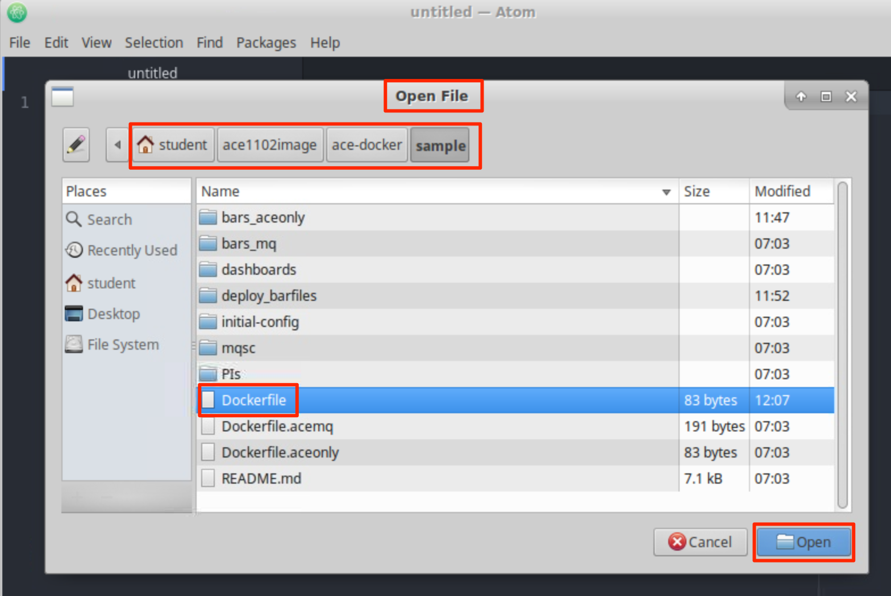{width="4.466416229221347in"
height="2.6557370953630794in"}

16. In the **Dockerfile**, make the following updates:

    Replace FROM ace-only:latest to FROM ace1102image:latest

Replace bars\_aceonly with deploy\_barfiles

After updating the file should look like this:

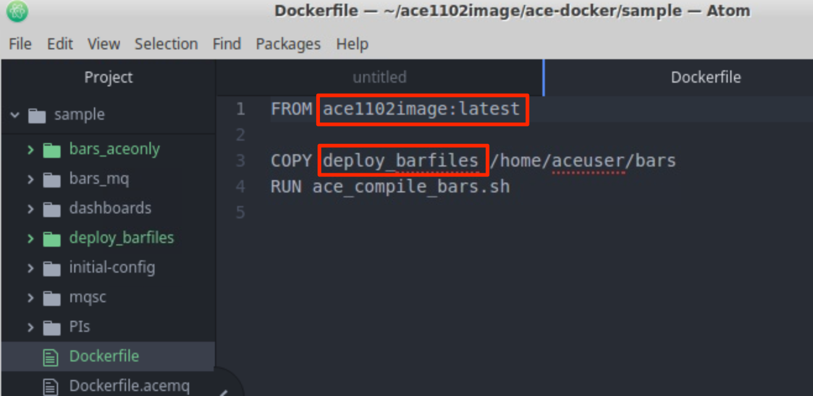{width="4.5901640419947505in"
height="2.239176509186352in"}

17. Save and close the file.

18. We will now use the Dockerfile to build a docker image with the ACE
    V11.0.0.2 base image we previously built and package the integration
    application onto the image using the below command:

> Docker build -t ace1102app1 \--file Dockerfile .

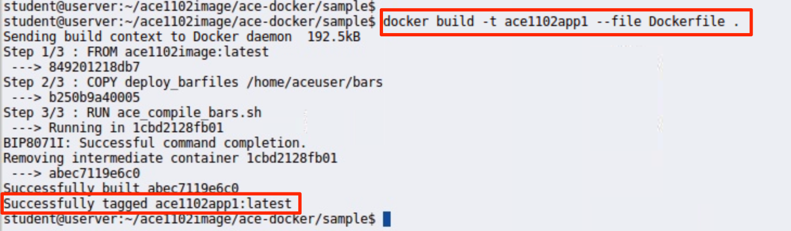{width="5.189558180227472in"
height="1.5163932633420822in"}

19. Run the command 'docker images' and you should see the images that
    was built.

> 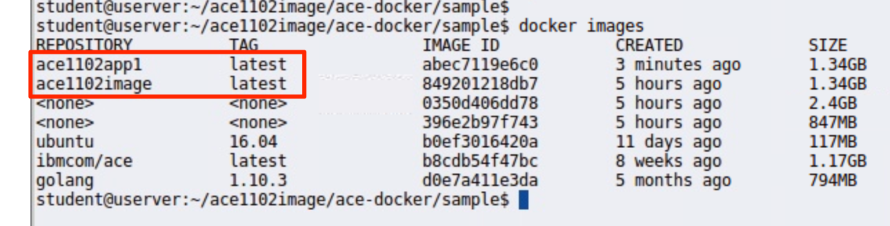{width="6.5in"
> height="1.6527777777777777in"}
>
> The image **ace1102image** is the base image for ACE V11.0.0.2 that
> can be used to build images with integration applications. You can
> also build images with different versions of ACE in this manner for
> packaging and deployment
>
> The image **ace1102app1** is a your customized docker image with ACE
> V11.0.0.2 and the integration application Customer that was developed
> in Part 1 of the lab.

Load the custom docker image into IBM Cloud Private docker image repository 
----------------------------------------------------------------------------

20. Next, the custom docker image **ace1102app1** has to be pushed to a
    docker registry for deployment. A docker registry holds docker
    images for different tagged versions. IBM Cloud Private (ICP)
    provides a private registry which stores images to be deployed. The
    next steps will push the custom docker image **ace1102app1** from
    local file system to the registry on ICP.

21. Login to ICP image registry using command and credentials:

    docker login mycluster.icp:8500

    Enter Username: **admin** and Password: **admin**

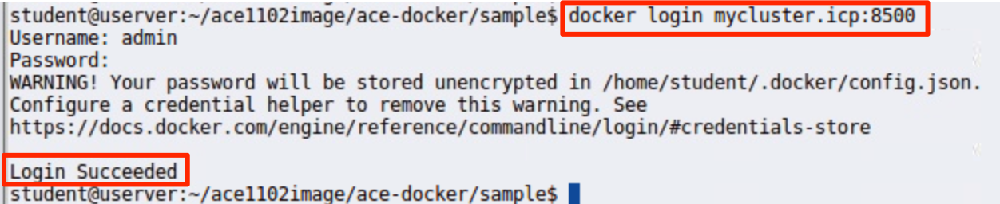{width="4.6305555555555555in"
height="1.0737707786526685in"}

22. To push an image from local file system to ICP image registry, the
    must be tagged with the cluster domain and namespace. The ICP
    cluster domain is 'mycluster.icp' and we will use default
    'namespace'.

> Run the command to tag the image to push to ICP image registry:

docker tag ace1102app mycluster.icp:8500/default/ace1102app:latest

23. Run the command 'docker images' and you can see the image you tagged
    in previous step as shown below.

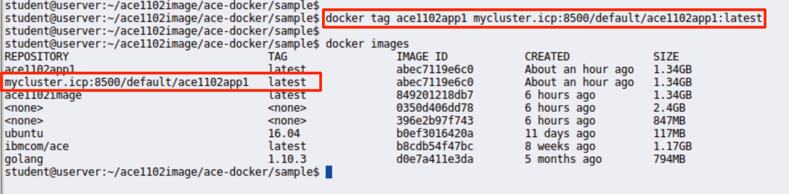{width="5.8114752843394575in"
height="1.6020833333333333in"}

24. Push the docker image to ICP image registry using command. Note this
    step will take a few minutes.

> docker push mycluster.icp:8500/default/ace1102app1:latest

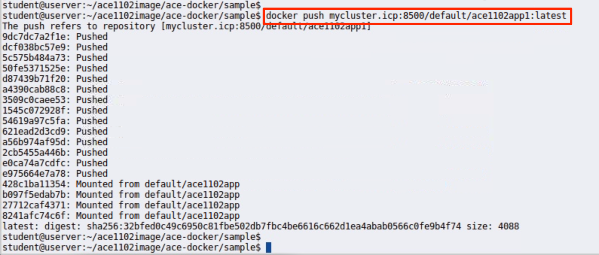{width="5.8101399825021876in"
height="2.3032786526684164in"}

25. The pushed image should now appear in ICP Container Images. Log into
    ICP console to check the image. Open a Firefox browser and click on
    the ICP Console bookmark in the tool bar.

> 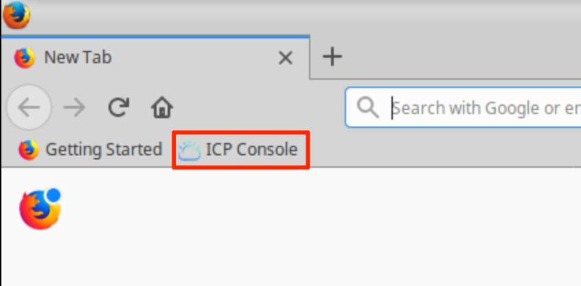{width="3.99951990376203in"
> height="1.4918022747156605in"}

26. Login to ICP Console using the saved credentials. If you need to
    enter the credentials, enter Username admin and Password admin

> 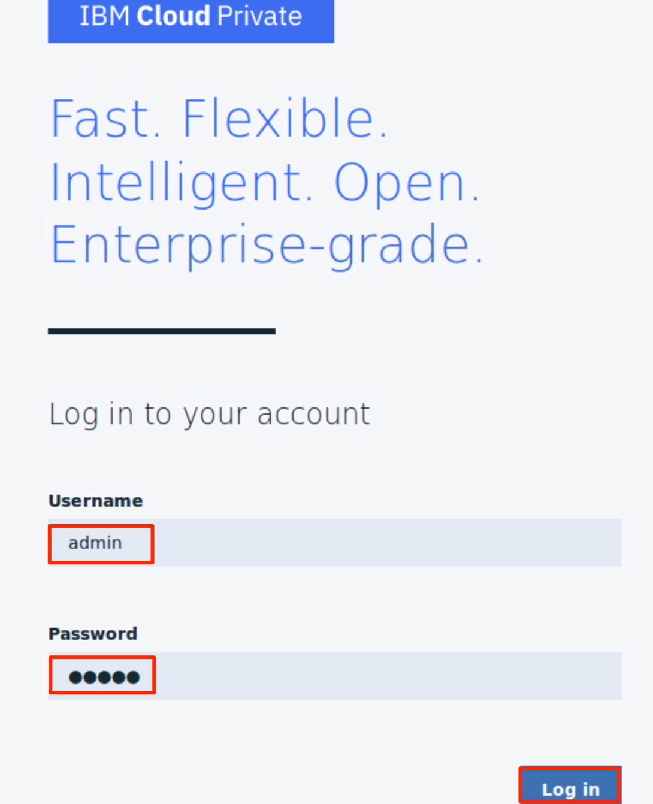{width="2.671527777777778in"
> height="2.8278685476815397in"}

27. Click on the hamburger menu in the top left and select **Container
    Images**

> 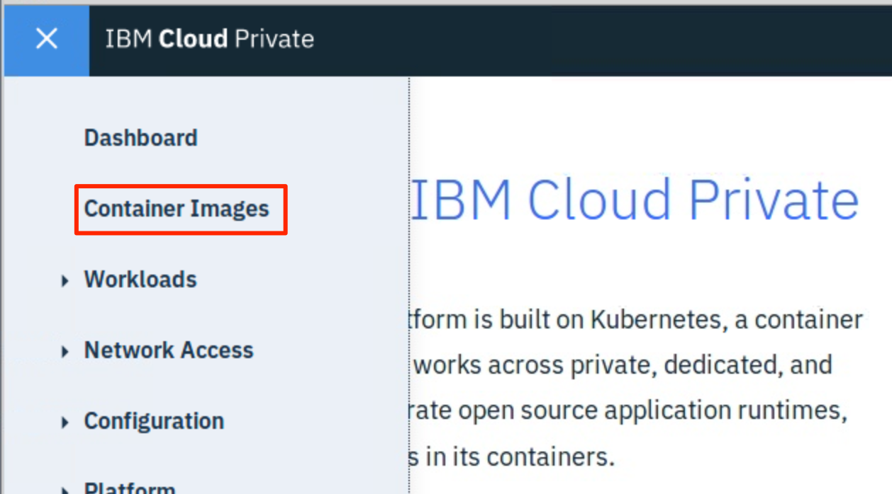{width="4.17213145231846in"
> height="1.6637423447069117in"}

28. In Container Images, you can see the custom image that was pushed to
    ICP image registry in the previous steps.

> 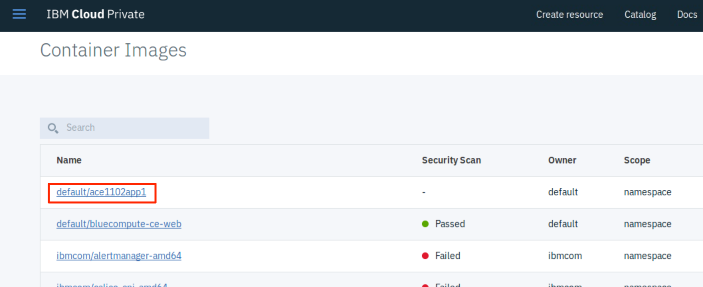{width="5.6005347769028875in"
> height="2.286884295713036in"}

Create and load helm chart into IBM Cloud Private
-------------------------------------------------

29. The image is now ready for deployment in ICP. Next, we will create a
    helm chart for deployment of the image. Helm is an application
    package manager that is used for ICP. We will clone a ACE helm
    public GitHub repository which provides standard configuration and
    guidance. This repository is available at:

    https://github.com/ot4i/ace-helm

30. Open a terminal window and create directory using the command mkdir
    \<directory name\>. In this lab we are using 'ace-helm-charts' as
    the directory name.

31. Change into the directory 'ace-helm-charts' and clone ACE helm
    public Github repository. This repository provides pre-built helm
    configuration files with a standard initial customization to package
    the container image for deployment. Review the github repository for
    usage and guidance on customization. Clone the repository using
    command:

    git clone https://github.com/ot4i/ace-helm

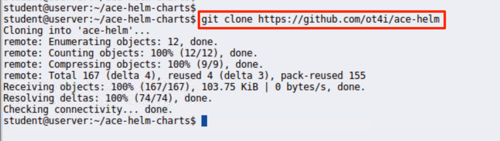{width="5.508196631671041in"
height="1.8402777777777777in"}

32. The git clone has a directory 'ace-helm/ibm-ace' directory which
    provides pre-configured files to build a helm chart. Change
    directory to 'ace-helm' and make a copy of the directory 'ibm-ace'
    to customize for the container image created in previous steps and
    customize for this deployment.

> cd ace-helm
>
> cp -R ibm-ace ace1102app1

33. Change directory to ace1102app1 and review the configuration yaml
    files . The files Chart.yaml and values.yaml require customizing for
    building a helm chat for container image.

34. To keep customizing to minimum, pre-configuration Chart.yaml and
    values.yaml are provided for the lab. Copy these files from
    /home/student/labfiles directory and overwrite the existing files in
    ace1102app1 directory.

> cp \~/labfiles/\*.yaml .

35. Review the copied files Chart.yaml and values.yaml and the changes
    in the files. In Chart.yaml, the chart name is updated to
    ace1102app1. In values.yaml, the license parameter is changed to
    "accept" and the image is updated to container image in the ICP
    image registry which is default/ace1102app1.

36. Helm provides the ability to validate the helm chart prior to
    packaging and deploy. Change directory to one level higher to run
    the helm validation and package commands.

    cd \~/ace-helm-charts/ace-helm

37. Run the following command to validate the configuration in the
    charts.

> helm lint ace1102app1

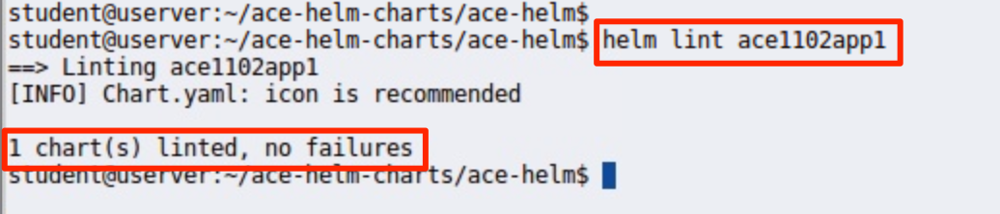{width="4.759970472440945in"
height="0.8524595363079615in"}

38. Package the helm chart by running the following command:

> helm package ace1102app1

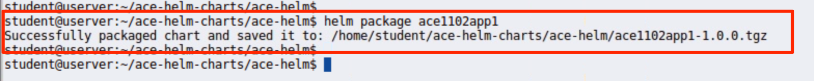{width="6.106557305336833in"
height="0.6152230971128609in"}

39. Next step is to load the helm chat into ICP catalog for deployment.
    To load the chart into ICP catalog, first login to ICP using the
    following ICP CLI command:

> cloudctl login -u admin -p admin -a https://mycluster.icp:8443

40. Select the default namespace by entering 2 at the prompt as shown
    below:

> 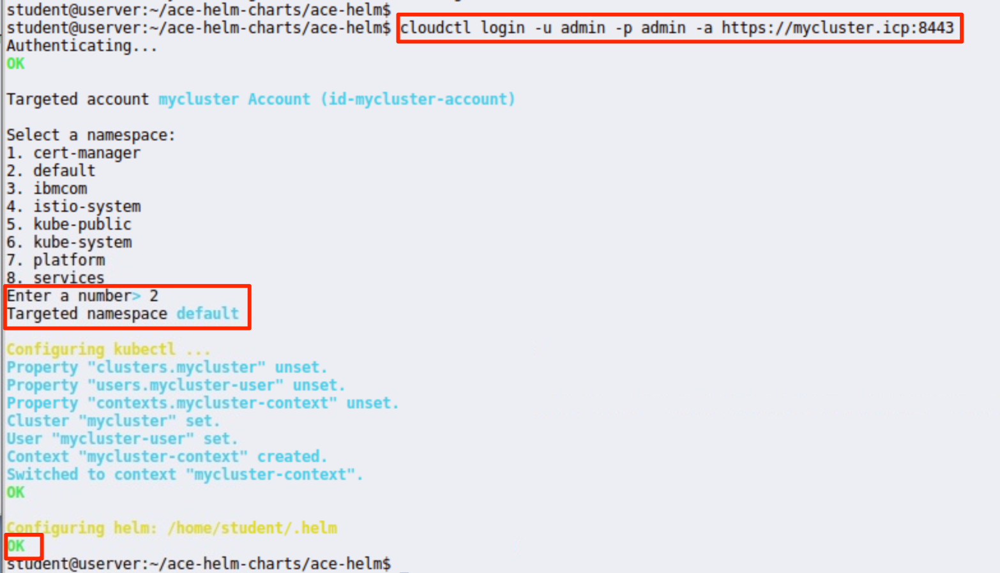{width="5.877049431321085in"
> height="2.9180555555555556in"}

41. Load the helm chart into ICP catalog using the following command:

> cloudctl catalog load-chart \--archive ace1102app1-1.0.0.tgz \--repo
> local-charts

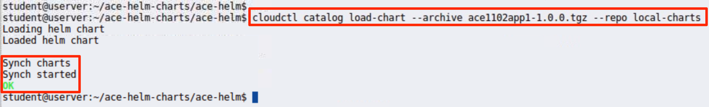{width="5.876388888888889in"
height="1.2113418635170603in"}

42. The helm chart should now be available in ICP Catalog for
    deployment. Switch over to Firefox browser to the ICP Console window
    and click on Catalog. The loaded helm chart will appear in the ICP
    Catalog as shown below:

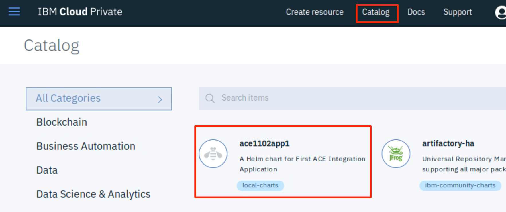{width="5.565277777777778in"
height="2.286885389326334in"}

Deploy the helm chart and test the integration application
----------------------------------------------------------

43. Next to deploy the helm chart, a image pull secret is required. An
    **imagePullSecret** is an authorization token, also known as a
    secret, that stores Docker credentials that are used for accessing a
    registry. Create image pull secret 'registrykeyace' using the
    following command:

> kubectl create secret docker-registry registrykeyace
> \--docker-server=mycluster.icp:8500 \--docker-username=admin
> \--docker-password=admin

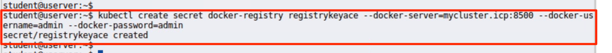{width="6.5in"
height="0.5694444444444444in"}

44. In the ICP console, in Catalog, click on the helm chart ace1102app1
    to open the chart and start deployment.

> {width="5.696721347331583in"
> height="2.3937182852143484in"}

45. Scroll down and browse the chart and you can see the description and
    additional information. Also notice the chart version is 1.0.0. When
    the package is updated due to application changes or fixes the
    version of the helm chart can be updated. Click on Configuration
    tab.

> 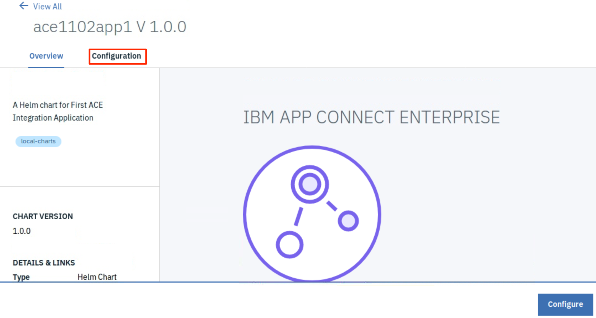{width="4.9672134733158355in"
> height="2.6518339895013123in"}

46. In Configuration tab, provide Helm release name 'ace1102app1' and in
    the Target namespace drop down select 'default'

> 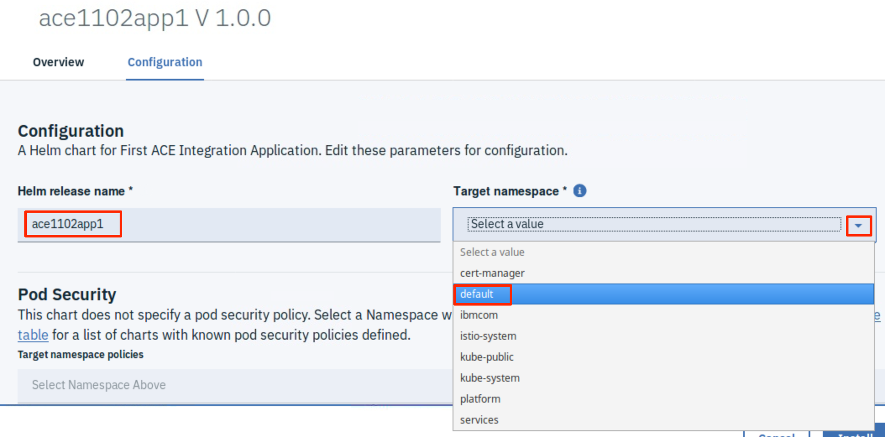{width="5.877049431321085in"
> height="2.905246062992126in"}

47. Scroll down and click on 'All parameters'

    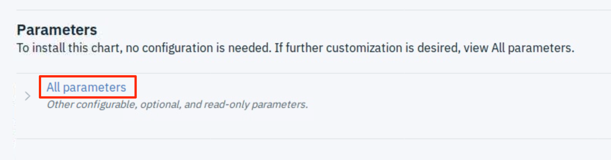{width="5.811111111111111in"
    height="1.3278685476815397in"}

48. Scroll down to image section and provide the image pull secret
    'registrykeyace' created earlier in the pullSecret property

    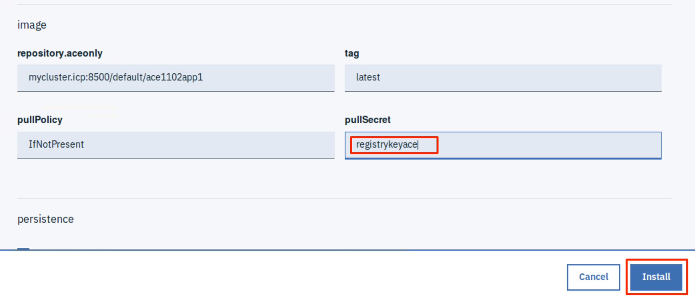{width="5.74590113735783in"
    height="2.356794619422572in"}

49. Click on **Install** to start the installation of the chart.

50. You will see the below window pop up. Click on View Helm Release

> 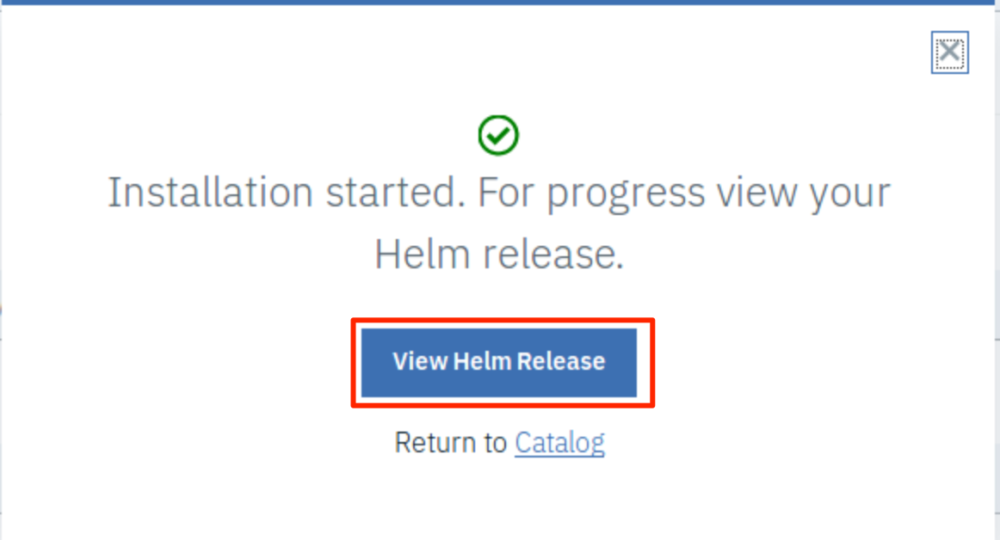{width="3.991803368328959in"
> height="2.157536089238845in"}

51. You can see the deployment status and details of deployment.

> 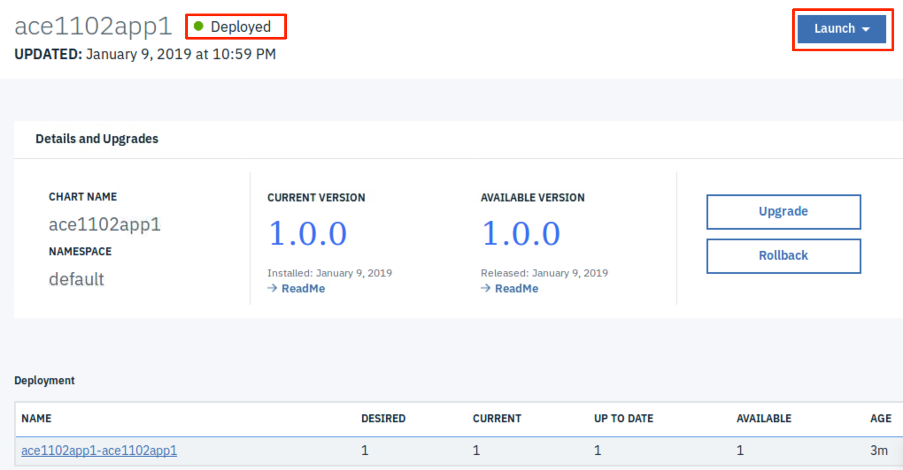{width="5.401639326334208in"
> height="2.8173939195100615in"}

52. On the top right **Launch** button, drop down and select **webui**.

> 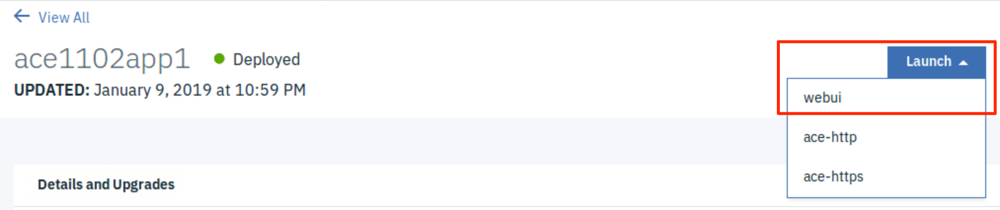{width="5.730707567804025in"
> height="1.2049179790026248in"}

53. ACE webui will open in a new browser window and will show
    integration server running one application Customer.

> 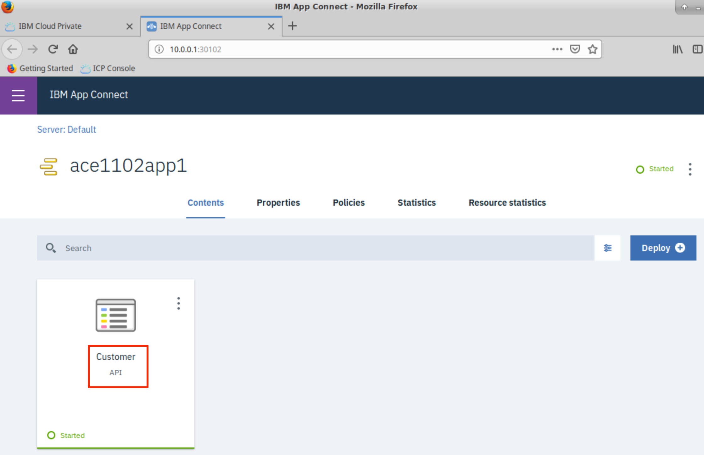{width="4.639343832020997in"
> height="2.9977296587926507in"}

54. Switch back to the ICP console window and scroll down to view the
    deployment information. Scroll down to **Service** section. This
    shows the port mapping as shown below:

> 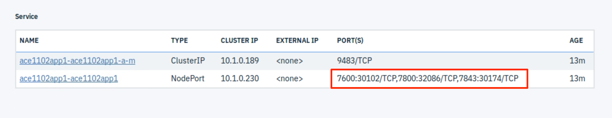{width="6.5in"
> height="1.3524595363079615in"}

55. From the above port mapping, get the port mapping for the
    HTTPListener port 7800. In this case, port 7800 is mapped to
    port 32086.

56. Open a new browser window and test the REST API using the port that
    has been identified above. Enter the below url in the brower to
    test. You should see the below response.

> http://10.0.0.1:32086/customer/v1/123

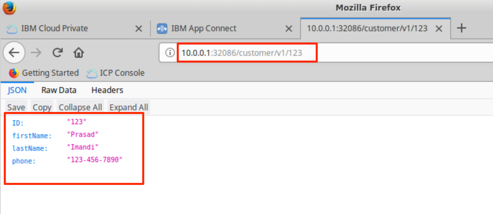{width="5.696721347331583in"
height="2.481968503937008in"}

This completes Part 2 of the lab.

**We Value Your Feedback!**
===========================

-   Don't forget to submit your Think 2019 session and speaker feedback!
    Your feedback is very important to us -- we use it to continually
    improve the conference.

-   Access the Think 2019 agenda tool to quickly submit your surveys
    from your smartphone, laptop or conference kiosk.
